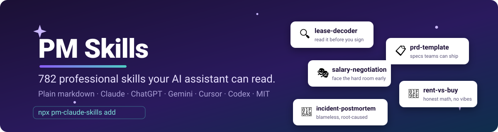
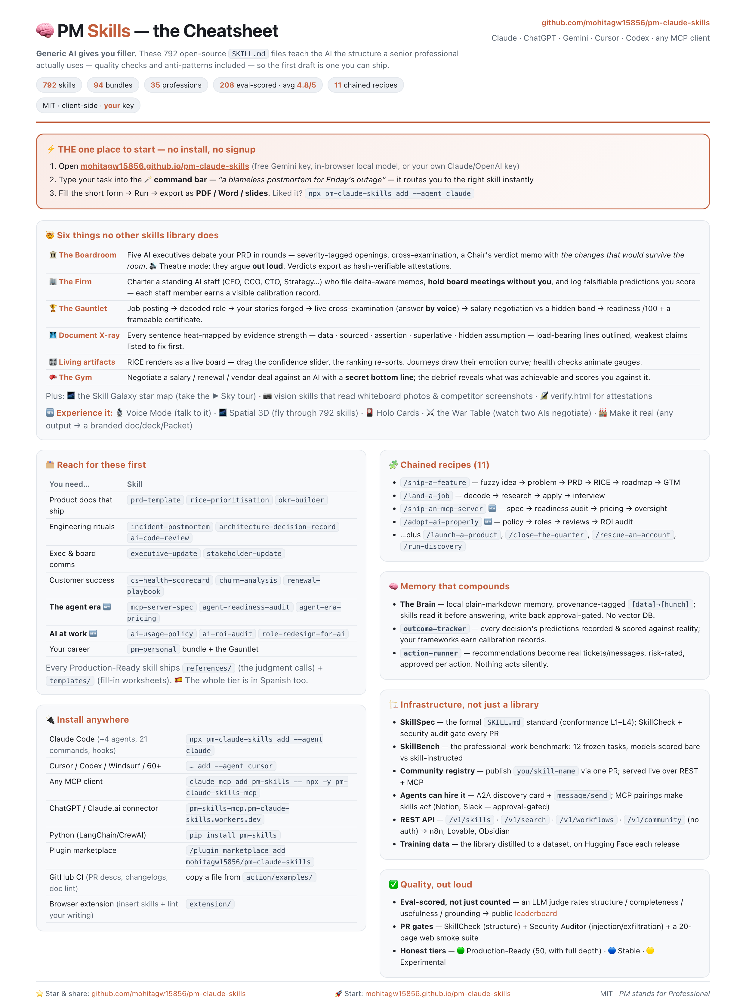

# 🧠 PM Skills — 771 Professional Agent Skills for Claude, ChatGPT, Gemini, Cursor, Codex & Hermes

<p align="center">
  <a href="https://mohitagw15856.github.io/pm-claude-skills/">
    
  </a>
</p>

[](#-quick-start)
[](https://github.com/mohitagw15856/pm-claude-skills/stargazers)
[](https://www.npmjs.com/package/pm-claude-skills)
[](https://pypi.org/project/pm-skills/)
[](SKILLS.md)
[](.github/workflows/skillcheck.yml)
[](conformance/REGISTRY.md)
[](.github/workflows/skill-audit.yml)
[](https://github.com/mohitagw15856/pm-claude-skills/releases)
[](LICENSE)
[](https://github.com/sponsors/mohitagw15856)
[](https://pm-skills-mcp.pm-claude-skills.workers.dev/today.json)
[](https://mohitagw15856.github.io/pm-claude-skills/)

**A library of 771 skills — each one a plain `SKILL.md` file that teaches your AI assistant to do one professional task properly.** Decode a lease before you sign it. Write a PRD your team can execute. Simulate the promotion committee before the real one meets. Check the weather with zero API keys. Generic AI gives you filler; these give you the structure a senior professional actually uses.

Works natively in **Claude Code** and **Hermes Agent**, with ready-to-paste exports for **ChatGPT, Gemini, Cursor, Codex** and 8 more tools. *(PM stands for Professional, not just Product Management.)*

<p align="center">
  <a href="docs/installation.md"></a>
  <a href="exports/chatgpt/"></a>
  <a href="exports/gemini/"></a>
  <a href="docs/installation.md"></a>
  <a href="mcp-remote/"></a>
  <br>
  <a href="integrations/telegram/"></a>
  <a href="integrations/slack-app/"></a>
  <a href="integrations/raycast/"></a>
  <a href="integrations/obsidian-plugin/"></a>
  <a href="connectors/"></a>
  <br>
  <a href="https://pypi.org/project/pm-skills/"></a>
  <a href="dataset/"></a>
  <a href="Dockerfile"></a>
  <a href="action/"></a>
</p>

## 🐣 New here? Pick a door — each takes about 30 seconds

1. **Just looking →** open the **[▶ Playground](https://mohitagw15856.github.io/pm-claude-skills/)** and run a skill in your browser. Nothing to install, nothing to sign up for.
2. **You use Claude Code →** type `/plugin`, search **pm-skills**, install. Done — ask *"decode this lease"* and watch.
3. **You use anything else →** `npx pm-claude-skills add` and pick your tool from the menu (Cursor, Codex, Windsurf, ChatGPT, Gemini…).

**Nothing here can scare your setup.** A skill is a markdown file your AI reads — no runtime, no telemetry, no accounts. Installing copies text files; uninstalling is deleting them. Skeptical? Good instinct: [read one first](skills/lease-decoder/SKILL.md) — it's designed to be read by humans too.

## ⚡ Quick start

| You want to… | Do this |
|---|---|
| **Browse the skills** | **[SKILLS.md](SKILLS.md)** — the full catalog · or the [searchable web catalog](https://mohitagw15856.github.io/pm-claude-skills/catalog.html) |
| **Install in Claude Code** | `/plugin` → search **pm-skills** *(it's in the official Anthropic directory)* — or `npx pm-claude-skills add --agent claude` |
| **Install in Cursor / Codex / Windsurf / Cline…** | `npx pm-claude-skills add --agent cursor` *(or `codex`, `windsurf`, `aider`, `cline`, `zed`…)* |
| **Use one skill in ChatGPT / Gemini** | Copy it from [`exports/chatgpt/`](exports/chatgpt/) or [`exports/gemini/`](exports/gemini/) and paste as instructions |
| **Skills over MCP, in any session** | `claude mcp add pm-skills -- npx -y pm-claude-skills-mcp` |

No `npm install` needed — `npx pm-claude-skills …` always runs the latest. `npx pm-claude-skills list` shows everything in your terminal. Full per-tool instructions: **[docs/installation.md](docs/installation.md)**.

## 📚 The skills

Every skill follows the same discipline: what it produces, the inputs it needs, a real framework (severity scales, decision rules — not vibes), a concrete output template, quality checks, and anti-patterns. All 771 pass the [SkillSpec](SKILLSPEC.md) L3 gate and a security audit in CI.

<table align="center">
  <tr align="center">
    <td><a href="plugins/pm-decoders/"></a></td>
    <td><a href="plugins/pm-simulators/"></a></td>
    <td><a href="plugins/pm-calculators/"></a></td>
    <td><a href="plugins/pm-live/"></a></td>
    <td><a href="plugins/pm-cowork/"></a></td>
    <td><a href="plugins/pm-tokens/"></a></td>
    <td><a href="plugins/pm-seatbelt/"></a></td>
    <td><a href="plugins/pm-essentials/"></a></td>
  </tr>
  <tr align="center">
    <td><a href="plugins/pm-decoders/"><b>Decoders</b></a></td>
    <td><a href="plugins/pm-simulators/"><b>Simulators</b></a></td>
    <td><a href="plugins/pm-calculators/"><b>Calculators</b></a></td>
    <td><a href="plugins/pm-live/"><b>Live&nbsp;data</b></a></td>
    <td><a href="plugins/pm-cowork/"><b>Cowork</b></a></td>
    <td><a href="plugins/pm-tokens/"><b>Tokens</b></a></td>
    <td><a href="plugins/pm-seatbelt/"><b>Seatbelt</b></a></td>
    <td><a href="plugins/pm-essentials/"><b>Essentials</b></a></td>
  </tr>
</table>

### For everyone — life's paperwork and decisions

| Family | What it does | Examples (of many) |
|---|---|---|
| 🔍 **Decoders** (25+) | Read the document *before* you sign it — plain language, 🔴🟡🟢 severity, the money math | [lease](skills/lease-decoder/SKILL.md) · [medical bill](skills/medical-bill-decoder/SKILL.md) · [job offer](skills/benefits-decoder/SKILL.md) · [severance](skills/severance-agreement-decoder/SKILL.md) · [insurance policy](skills/insurance-policy-decoder/SKILL.md) · [contractor quote](skills/home-contractor-quote-decoder/SKILL.md) · [timeshare](skills/timeshare-contract-decoder/SKILL.md) |
| 🎭 **Simulators** | Face the adversary early — the real meeting, then an out-of-character debrief | [salary negotiation](skills/salary-negotiation/SKILL.md) · [promotion committee](skills/the-promotion-committee/SKILL.md) · [thesis defense](skills/the-thesis-defense/SKILL.md) · [visa interview](skills/the-visa-interview/SKILL.md) · [due-diligence call](skills/the-due-diligence-call/SKILL.md) |
| 🧮 **Calculators** | Deterministic Python scripts + honest models — assumptions labeled, no false precision | [rent vs buy](skills/rent-vs-buy/SKILL.md) · [FIRE number](skills/fire-number/SKILL.md) · [debt payoff](skills/debt-payoff/SKILL.md) · [raise vs jump](skills/raise-vs-jump/SKILL.md) · [daycare vs stay-home](skills/daycare-vs-stay-home/SKILL.md) |
| 📡 **Live data** (17) | Real-time answers with **zero API keys** — weather, rates, flights, scores, all over plain curl | [weather](skills/weather-now/SKILL.md) · [currency](skills/currency-rates/SKILL.md) · [crypto](skills/crypto-prices/SKILL.md) · [flights](skills/flight-tracker/SKILL.md) · [earthquakes](skills/earthquake-watch/SKILL.md) · [is-it-down](skills/site-check/SKILL.md) |
| 🏠 **Life admin** | The unglamorous logistics, done in order | [relocation](skills/relocation-planner/SKILL.md) · [new parent](skills/new-parent-logistics/SKILL.md) · [caregiving](skills/caregiver-coordination/SKILL.md) · [doctor visits](skills/doctor-visit-prep/SKILL.md) · [records requests](skills/medical-records-request/SKILL.md) |
| 💼 **Career moments** | The weeks that decide years | [layoff kit](plugins/pm-layoff/) · [resignation kit](plugins/pm-resignation/) · [PIP response](skills/pip-responder/SKILL.md) · [first 90 days as manager](skills/manager-first-90-days/SKILL.md) · [interview gauntlet](plugins/pm-jobsearch/) |
| 🧾 **Freelance & renters & parents** | Small bundles for specific lives | [pricing your services](skills/pricing-your-services/SKILL.md) · [late invoices](skills/late-invoice-escalation/SKILL.md) · [deposit recovery](skills/security-deposit-recovery/SKILL.md) · [IEP meetings](skills/iep-504-meeting-kit/SKILL.md) · [students](plugins/pm-students/) |
| 🤝 **Cowork** (100) | The office knowledge work an AI coworker actually does — the *frameworks* — [the whole bundle](plugins/pm-cowork/) | [email triage](skills/email-triage-system/SKILL.md) · [spreadsheet audit](skills/spreadsheet-audit/SKILL.md) · [meeting cost meter](skills/meeting-cost-meter/SKILL.md) · [deck outline first](skills/deck-outline-first/SKILL.md) · [saying no kindly](skills/saying-no-kindly/SKILL.md) · [delegation brief](skills/delegation-brief/SKILL.md) |
| ⚡ **Cowork · Live** (12) | The same jobs, *done* — Claude Cowork acts on your **real data** via connectors + sandbox and returns an artifact — [the whole bundle](plugins/pm-cowork-live/) | [inbox triage (live)](skills/inbox-triage-live/SKILL.md) · [meeting prep (live)](skills/meeting-prep-live/SKILL.md) · [spreadsheet audit (live)](skills/spreadsheet-audit-live/SKILL.md) · [deck from doc](skills/deck-from-doc/SKILL.md) · [thread → decision](skills/thread-to-decision-live/SKILL.md) · [PR description (live)](skills/pr-description-live/SKILL.md) |

### For professionals — 35 fields

| | | |
|---|---|---|
| 📋 [Product Management](plugins/pm-essentials/) | 💻 [Engineering](plugins/pm-engineering/) | 📣 [Marketing & GTM](plugins/pm-gtm/) |
| 🤝 [Customer Success](plugins/pm-cs/) | 📊 [Data & Analytics](plugins/pm-data/) | 👥 [Leadership & People](plugins/pm-people/) |
| 🎨 [Design & UX](plugins/pm-design/) | ⚖️ [Legal](plugins/pm-legal/) | 💰 [Finance](plugins/pm-finance/) |
| 🚀 [Founders](plugins/pm-founders/) | 🔐 [Security](plugins/pm-security/) | 🏛 [Government](plugins/pm-gov/) |

…plus HR, sales, operations, research, healthcare, educators, writers, social media, and more — **[the full profession index](SKILLS.md)**, or by bundle in [`plugins/`](plugins/) (94 bundles). Install any bundle: `/plugin install pm-decoders@pm-skills`.

### Meta

Before installing *anyone's* skills (including these): [skill-vetting](skills/skill-vetting/SKILL.md) — a security read for SKILL.md files. The library's own standard lives in [SKILLSPEC.md](SKILLSPEC.md); every skill's level is enforced in CI.

## 🔍 What a skill looks like

```markdown
---
name: lease-decoder
description: "Decode a residential lease into plain English and rank the
  clauses that can hurt you. Use when someone asks 'what am I signing'…"
---
## Framework: Severity Scale
- 🔴 Can cost you real money — auto-renewal into a full new term, break
  penalties beyond re-rental costs, deposit conditions written to fail…
```

That's the whole trick: it's markdown. Your agent reads it and gains the judgment; you can read it too, audit it, edit it, or [write your own](SKILL-AUTHORING-STANDARD.md). No lock-in, no runtime, no telemetry.

## 💸 Cut your token bill

The **[pm-tokens](plugins/pm-tokens)** bundle optimizes every stage of your agent's token journey — no API keys, stdlib Python, nothing leaves your machine. Five habits, typically **30–60% off a session's token flow**:

```bash
# 1. Map the repo instead of reading it (~3% of the cost of reading everything)
python3 skills/repo-map/scripts/repo_map.py .

# 2. Crush bulk before it enters context (98% smaller on uniform JSON; errors always survive)
python3 skills/context-crusher/scripts/context_crush.py --mode json --file response.json

# 3. Measure what anything costs — at YOUR prices, times YOUR call volume
python3 skills/token-cost/scripts/token_cost.py --file CLAUDE.md --price-in 3 --calls 200
```

Plus the judgment skills: [token-diet](skills/token-diet/SKILL.md) (output costs 3–5× input — diet it where safe), [context-budget](skills/context-budget/SKILL.md) (cache-aware layout: stable first, volatile last), and [session-handoff](skills/session-handoff/SKILL.md) (resume at ~5% of transcript size). **See your own breakdown in the [🪙 Token Dashboard](https://mohitagw15856.github.io/pm-claude-skills/tokens.html)** — paste what rides in your context, get computed per-piece savings, all in-browser. The full how-to: **[docs/SAVE-TOKENS.md](docs/SAVE-TOKENS.md)**.

## 🤝 Make the most of the cowork skills

The **[pm-cowork](plugins/pm-cowork)** bundle is 100 skills for the office work an AI coworker actually does. Install it (`/plugin install pm-cowork@pm-skills`), then — the whole trick — **describe your mess, don't name the skill**: say *"my inbox is 4,000 deep"*, *"nobody reads my status updates"*, *"this spreadsheet came from someone who left"* — the right skill activates on the ask.

**Start where it hurts:**

| Your pain | Say this | The skill that answers |
|---|---|---|
| Drowning in email | "triage my inbox and cut the volume at the source" | [email-triage-system](skills/email-triage-system/SKILL.md) → [inbox-unsubscribe-purge](skills/inbox-unsubscribe-purge/SKILL.md) |
| Calendar is all meetings | "audit my recurring meetings and price them" | [standing-meeting-audit](skills/standing-meeting-audit/SKILL.md) + [meeting-cost-meter](skills/meeting-cost-meter/SKILL.md) |
| Inherited a scary spreadsheet | "audit this sheet before we trust it" | [spreadsheet-audit](skills/spreadsheet-audit/SKILL.md) → [formula-detangler](skills/formula-detangler/SKILL.md) |
| Docs get rewritten in review | "outline first, get sign-off, then draft" | [outline-before-prose](skills/outline-before-prose/SKILL.md) |
| Weeks just happen to you | "set up my weekly review" | [weekly-review-ritual](skills/weekly-review-ritual/SKILL.md) — the hub the others plug into |

**Three habits that compound:** (1) **The weekly review is the keystone** — it feeds [task-triage-matrix](skills/task-triage-matrix/SKILL.md), [deep-work-blocking](skills/deep-work-blocking/SKILL.md), and [personal-wip-limits](skills/personal-wip-limits/SKILL.md) automatically. (2) **The skills chain on purpose** — email-to-tasks feeds the task triage; the meeting audit feeds async-instead; delegation-brief hands off what the triage says to shed — follow the links inside each skill. (3) **Teams adopt one norm at a time** — start with [agenda-or-cancel](skills/agenda-or-cancel/SKILL.md) or [working-agreements](skills/working-agreements/SKILL.md), let it stick, then add the next; the ten-norms-on-Monday rollout is how none of them survive.

## 🔬 Prove it, and stop paying rent

Two CLI tools for the trust-and-cost problems the ecosystem keeps hand-waving — both keyless-to-inspect, both one command:

```bash
# Does your skill actually work? Prove it. Paired A/B — skill on vs off, same tasks,
# REAL token counts from the API's usage fields, optional blind judge, sha-pinned receipt.
npx pm-claude-skills prove --skill ./my-skill --tasks tasks.txt --runs 2 --judge
npx pm-claude-skills prove --skill ./my-skill --tasks tasks.txt --dry-run   # plan + call count, spends nothing

# Your MCP servers are charging you rent. Measure it: per-server token cost,
# unused-in-N-days flags, "disconnect these three, save X tokens per message".
npx pm-claude-skills mcp-audit --connect
```

`prove` exists because the ecosystem is full of "65% better!" claims and almost none are measured — it's the honest-broker harness (the JetBrains "advertised 65%, measured 8.5%" story is exactly why). `mcp-audit` reads your Claude configs, speaks real MCP to each server to count its schema tokens, and scans your session logs for what you actually use. See also the **[📊 AI Spend](https://mohitagw15856.github.io/pm-claude-skills/spend.html)** page — every agent's cost (Claude Code, Codex, Copilot) in one meter, all in-browser.

**Agent safety:** the **[pm-seatbelt](plugins/pm-seatbelt)** bundle is the pre-flight checklist before an agent touches email, the browser, or files — least-privilege reviews, [prompt-injection spotting](skills/injection-spotter/SKILL.md), and the [blast-radius drill](skills/blast-radius-drill/SKILL.md) for going autonomous. And **[RFC 0002 — HANDOFF.md](docs/rfcs/0002-agent-handoff-file.md)** is a dead-simple session-handoff convention (*your agent, but it remembers Monday*) — a file, not a server, with [reference hooks](hooks/).

## ✅ Quality, not just quantity

- **Every skill passes the [SkillSpec](SKILLSPEC.md) L3 gate** — structure, framework, quality checks, anti-patterns — enforced in CI on every commit
- **[Eval-scored](https://mohitagw15856.github.io/pm-claude-skills/leaderboard.html)** — 208 scored outputs, avg 4.8/5, judged blind
- **Security-audited** — a dedicated CI workflow sweeps every skill and script; calculators are stdlib-only and deterministic with byte-exact output tests
- **Honest by design** — decoders end with a not-legal-advice line, calculators name what they don't model, simulators debrief out of character, and skills that shouldn't ghostwrite (student statements) coach instead

## 🎁 Beyond the skills (the bonus material)

The library grew an ecosystem — all optional, all linked from the **[full showcase](docs/SHOWCASE.md)**:

**[▶ Skill Playground](https://mohitagw15856.github.io/pm-claude-skills/)** — try any skill in your browser, no install · **[📸 the Gallery](docs/GALLERY.md)** — the creative side, in screenshots · **[Anti-Pattern Museum](https://mohitagw15856.github.io/pm-claude-skills/museum.html)** — 2,900+ shareable rules · **[The Handbook](https://mohitagw15856.github.io/pm-claude-skills/handbook.html)** (also a [real printed book](docs/print/)) · **[Workflow recipes](WORKFLOWS.md)** · **[Subagents & slash commands](agents/)** · **[MCP server + REST API](mcp-remote/)** · **[n8n / Slack / Obsidian integrations](connectors/)** · **[The Boardroom](https://mohitagw15856.github.io/pm-claude-skills/boardroom.html)** · **[SkillBench](skillbench/)** · **[Org Edition](org/)** · **[🇪🇸 🇫🇷 🇨🇳 🇯🇵 translations](skills-i18n/)**

## 📄 The one-page cheatsheet

The whole library on one poster — start path, standout features, and install one-liners for every tool. Print it, share it, drop it in a slide.

<p align="center">
  <a href="https://mohitagw15856.github.io/pm-claude-skills/cheatsheet.html">
    
  </a>
</p>

**[🖼️ PNG](https://mohitagw15856.github.io/pm-claude-skills/docs-assets/cheatsheet.png)** · **[📄 PDF](https://mohitagw15856.github.io/pm-claude-skills/docs-assets/cheatsheet.pdf)** · **[🌐 Live poster](https://mohitagw15856.github.io/pm-claude-skills/cheatsheet.html)** · **[📥 Markdown](CHEATSHEET.md)**

## 🆕 Latest

**v62.1.0 — nine frontiers:** widgets in the chat, updates that find you, and the org goes multiplayer — **MCP Apps widgets** on the [hosted connector](mcp-remote/) (health scorecard, RICE matrix, and roadmap results render as interactive UI in Claude/ChatGPT), the **[update bot](action/update/)** (Dependabot for your vendored skills), **[shared sessions](org/SESSIONS.md)** (comment on and approve a skill run by link), a **[Telegram bot](integrations/telegram/)**, the **[local-model tier](docs/LOCAL-MODELS.md)** (same rubric, your Ollama), the **[SkillBench technical report](skillbench/REPORT.md)**, community translations via **[Crowdin](i18n/TRANSLATING.md)**, **[RFC-0003: paid community packs](docs/rfcs/0003-paid-community-packs.md)**, and the **[white-label partner program](org/white-label/)**. *Earlier — v62.0, adopt-a-profession* (pm-teaching, pm-hospitality, pm-journalism, pm-veterinary); *v61.3, most-requested skills;* *v61.1, the demand side* ([find](https://mohitagw15856.github.io/pm-claude-skills/find.html) + the honest badge). Full history: **[CHANGELOG](CHANGELOG.md)** · [releases](https://github.com/mohitagw15856/pm-claude-skills/releases)

## ❓ First-timer questions, straight answers

<details>
<summary><b>Is it actually free?</b></summary>
Yes — MIT, all 771 skills, forever. The skills are markdown; there is nothing to gate. Sponsors fund the playground's free model runs, not access.
</details>

<details>
<summary><b>Do I need an API key?</b></summary>
Not to browse, read, install, or use skills inside a tool you already have (Claude Code, ChatGPT, Cursor…). The playground even serves a few sponsor-funded free runs a day. A key only enters the picture for optional extras like running skills from CI.
</details>

<details>
<summary><b>I'm not a product manager. Is this for me?</b></summary>
PM stands for <i>Professional</i> here. Most of the library is decoders for leases and medical bills, salary-negotiation practice, career-moment kits, life admin, and 35 professions from teaching to veterinary. The product-management corner is just where it started.
</details>

<details>
<summary><b>Will this mess with my existing setup?</b></summary>
No. Skills are inert text files in a folder; your assistant reads them when relevant. Remove the folder and it's like they were never there. The CLI never touches anything outside the skills directory it tells you about.
</details>

<details>
<summary><b>How do I know these are any good?</b></summary>
Every skill passes a structural gate (SkillSpec L3) and a security scan in CI; 208 outputs are <a href="https://mohitagw15856.github.io/pm-claude-skills/leaderboard.html">eval-scored in the open</a> (avg 4.8/5), and the <a href="skillbench/REPORT.md">benchmark report</a> publishes the negative findings too. When something's machine-translated or unscored, it's labelled.
</details>

## 🤝 Contributing

Add a skill via PR ([the standard](SKILL-AUTHORING-STANDARD.md), [CONTRIBUTING](CONTRIBUTING.md)), request one via issue, or publish your own repo to the [community index](community/) and earn the badge. Translations follow the pattern in [`skills-i18n/`](skills-i18n/).

## ❤️ Support

If a skill saved you real money or a real mistake, **[star the repo](https://github.com/mohitagw15856/pm-claude-skills/stargazers)** — it's how others find it. Sponsors fund the playground's free runs and get [naming rights, not influence](docs/SPONSORSHIP.md): **[become a sponsor](https://github.com/sponsors/mohitagw15856)**.

## 📄 License

MIT — use them, fork them, ship them at work. Skills are judgment, and judgment wants to be free.

---

*Built by [Mohit](https://github.com/mohitagw15856) with Claude. 771 skills · 94 bundles · 35 professions · every commit gated. The long version of this README — every feature, wave, and frontier bet — lives in the **[Showcase](docs/SHOWCASE.md)**.*
